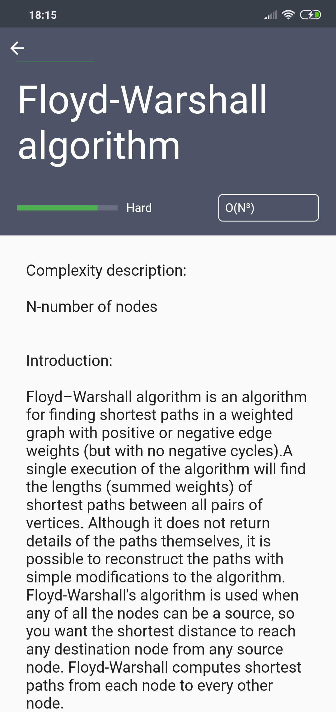

# Algorithm Visualizer
Flutter path finding visualizer

| Main menu      | Algorithm details      |  Simulation details      |  simulation      | 
|------------|-------------|-------------|-------------| 
| | | | |

 * Path finding algorithms available
    * Dijkstra's algorithm
    * Bellman-Ford algorithm
    * A-star algorithm
    * Floyd-Warshall algorithm
    * Johnson's algorithm
